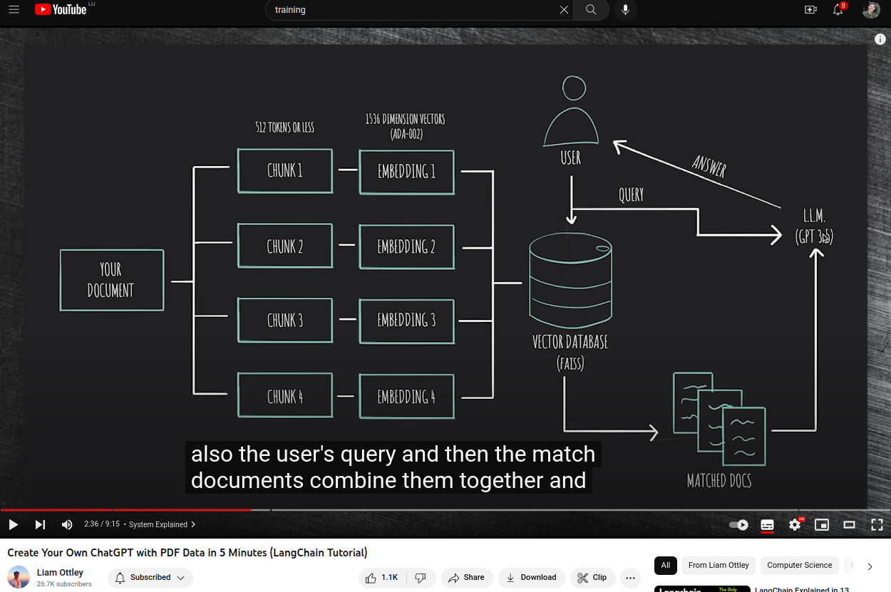

# Put arbitrary PDF content into LLM using langchain

- Contributions:
  Selected ChatGPT instead of text-davinci-three

Inspired by youtube video:
https://www.youtube.com/watch?v=au2WVVGUvc8&ab_channel=SamWitteveen

Original Colab:
https://colab.research.google.com/drive/1OZpmLgd5D_qmjTnL5AsD1_ZJDdb7LQZI?usp=sharing#scrollTo=KH546j3nkFwX

